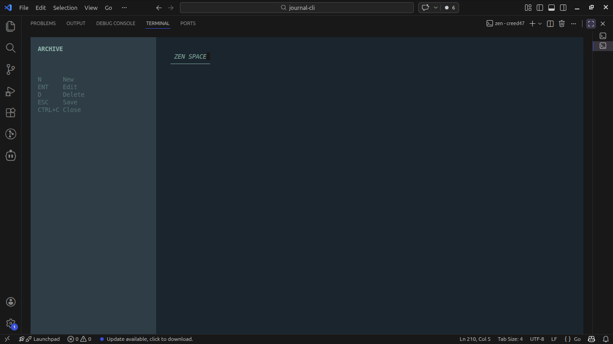

# Zentel Journal CLI

A beautiful, terminal-based journal application built with Go and the Bubble Tea framework. Capture your thoughts in a serene, distraction-free environment.

## Features

✨ **Minimalist Design** - Clean, zen-inspired interface with a carefully crafted color palette  
📝 **Rich Text Editing** - Full-featured text editor with syntax highlighting  
🗂️ **Organized Archives** - Automatic date-based journal organization  
⌨️ **Keyboard-First** - Optimized for keyboard navigation and efficiency  
💾 **Auto-Save** - Never lose your thoughts with automatic saving  
🎨 **Customizable** - Easy to modify color schemes and styling  

## Screenshots

### Application Interface

*Main interface showing the zen-inspired journal application with navigation sidebar and content area*

## Installation

### Prerequisites

- Go 1.24.2 or later
- A terminal that supports ANSI escape codes

### From Source

1. Clone the repository:
   ```bash
   git clone https://github.com/yordanos-habtamu/journal-cli.git
   cd journal-cli
   ```

2. Build the application:
   ```bash
   go build -o zen-journal
   ```

3. Run the application:
   ```bash
   ./zen-journal
   ```

### Quick Start

Simply run the main Go file:
```bash
go run main.go
```

## Usage

### Navigation Mode (Default)

When you first start the application, you're in navigation mode:

- **↑/k** - Move up the journal list
- **↓/j** - Move down the journal list  
- **n** - Create a new journal entry
- **Enter/e** - Edit selected journal entry
- **d** - Delete selected journal entry
- **Esc** - Return to navigation mode
- **Ctrl+C** - Quit application

### Edit Mode

When editing a journal entry:

- **Esc** - Save and return to navigation mode
- **Ctrl+C** - Quit without saving

### Journal Organization

- Journals are automatically saved in `~/.zen_v5/` directory
- Files are named with timestamps: `YYYYMMDD_HHMMSS.txt`
- The application automatically extracts the first line as the journal title
- Journals are displayed in reverse chronological order

## Configuration

### Color Scheme

The application uses a predefined zen color palette, but you can easily customize it by modifying the color variables in `main.go`:

```go
var (
    sand       = lipgloss.Color("#D8E2DC") // Text color
    evergreen  = lipgloss.Color("#2F3E46") // Sidebar background
    charcoal   = lipgloss.Color("#1B262C") // Main background
    leaf       = lipgloss.Color("#84A59D") // Accents
    softGold   = lipgloss.Color("#E9C46A") // Selection highlight
)
```

### Storage Location

To change where journals are stored, modify the `journalDir()` function in `main.go`:

```go
func journalDir() string {
    home, _ := os.UserHomeDir()
    dir := filepath.Join(home, ".your-custom-dir")
    _ = os.MkdirAll(dir, 0755)
    return dir
}
```

## Dependencies

This project uses the following Go packages:

- **github.com/charmbracelet/bubbles** - UI components for Bubble Tea
- **github.com/charmbracelet/bubbletea** - TUI framework
- **github.com/charmbracelet/lipgloss** - Beautiful terminal styling
- **github.com/charmbracelet/tea** - Terminal application framework

All dependencies are managed through Go modules.

## Development

### Building

```bash
go build -o zen-journal
```

### Testing

The application can be tested by running:

```bash
go run main.go
```

### Contributing

1. Fork the repository
2. Create a feature branch
3. Make your changes
4. Test thoroughly
5. Submit a pull request

## License

This project is licensed under the MIT License - see the [LICENSE](LICENSE) file for details.

```
MIT License

Copyright (c) 2026 journal-cli

Permission is hereby granted, free of charge, to any person obtaining a copy
of this software and associated documentation files (the "Software"), to deal
in the Software without restriction, including without limitation the rights
to use, copy, modify, merge, publish, distribute, sublicense, and/or sell
copies of the Software, and to permit persons to whom the Software is
furnished to do so, subject to the following conditions:

The above copyright notice and this permission notice shall be included in all
copies or substantial portions of the Software.

THE SOFTWARE IS PROVIDED "AS IS", WITHOUT WARRANTY OF ANY KIND, EXPRESS OR
IMPLIED, INCLUDING BUT NOT LIMITED TO THE WARRANTIES OF MERCHANTABILITY,
FITNESS FOR A PARTICULAR PURPOSE AND NONINFRINGEMENT. IN NO EVENT SHALL THE
AUTHORS OR COPYRIGHT HOLDERS BE LIABLE FOR ANY CLAIM, DAMAGES OR OTHER
LIABILITY, WHETHER IN AN ACTION OF CONTRACT, TORT OR OTHERWISE, ARISING FROM,
OUT OF OR IN CONNECTION WITH THE SOFTWARE OR THE USE OR OTHER DEALINGS IN THE
SOFTWARE.
```

## Support

If you encounter any issues or have suggestions for improvements, please open an issue on the GitHub repository.

## Contributing

Contributions are welcome! Please feel free to submit a Pull Request.

1. Fork the repository
2. Create your feature branch (`git checkout -b feature/amazing-feature`)
3. Commit your changes (`git commit -m 'Add some amazing feature'`)
4. Push to the branch (`git push origin feature/amazing-feature`)
5. Open a Pull Request

## Changelog

### v1.0.0
- Initial release
- Basic journal creation and editing
- Navigation interface
- Auto-save functionality
- Beautiful zen-inspired UI

## Acknowledgments

- [Bubble Tea](https://github.com/charmbracelet/bubbletea) - For the excellent TUI framework
- [Lip Gloss](https://github.com/charmbracelet/lipgloss) - For beautiful terminal styling
- [Charm](https://github.com/charmbracelet) - For creating amazing terminal tools
